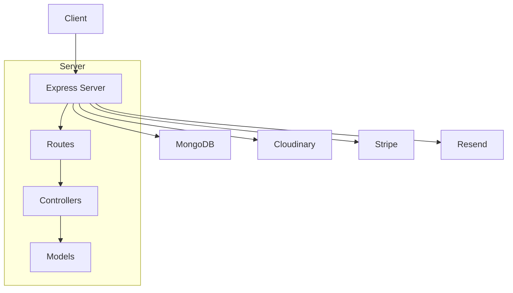
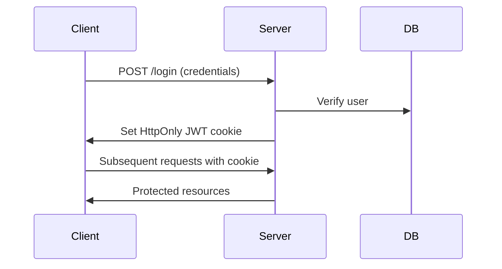

# Fatafat
Blinkit Clone - MERN Stack E-Commerce Platform

# project complite now some changes are pending

# FataFar Frontend Part

**Project Overview**

This `package.json` describes a React-based client-side application. Key characteristics include:

* **Modern React:** Using React 19.x and Vite for development.
* **State Management:** Employing Redux Toolkit for managing application state.
* **Routing:** Utilizing React Router DOM for navigation.
* **Data Fetching:** Axios for making HTTP requests.
* **UI Enhancements:** React Hot Toast for notifications, React Icons for icons, and React Type Animation for dynamic text effects.
* **Table Handling:** TanStack React Table for efficient table rendering.
* **Payment Integration:** Stripe.js for handling payment processing.
* **Form Handling:** React Hook Form for easy form management.
* **Cookies:** js-cookie to handle browser cookies.
* **Infinite Scrolling:** react-infinite-scroll-component for smooth data loading.
* **Alerts:** sweetalert2 for beautiful alerts.

**Dependencies (Runtime)**

These are the libraries required for the application to run in production.

* **`@reduxjs/toolkit` (^2.6.0):**
    * A powerful toolset for efficient Redux development. It simplifies Redux setup, reduces boilerplate code, and provides utilities like `createSlice` for defining reducers and actions.
    * Crucial for managing complex application state, ensuring data consistency, and improving performance.
* **`@stripe/stripe-js` (^6.0.0):**
    * The official Stripe JavaScript library for integrating Stripe payment processing into the frontend.
    * Enables secure handling of credit card information, creation of payment intents, and other payment-related functionalities.
* **`@tanstack/react-table` (^8.21.2):**
    * A headless table library for React. It provides the logic for sorting, filtering, pagination, and other table features without imposing a specific UI.
    * Ideal for building highly customizable and performant tables.
* **`axios` (^1.7.9):**
    * A promise-based HTTP client for making requests to APIs.
    * Used for fetching data from backend servers, sending form data, and handling other network operations.
* **`js-cookie` (^3.0.5):**
    * A simple and lightweight library for managing browser cookies.
    * Useful for storing user authentication tokens, session data, or other small pieces of information on the client-side.
* **`prop-types` (^15.8.1):**
    * A runtime type checker for React props.
    * Helps catch potential bugs by validating the types of props passed to components.
* **`react` (^19.0.0):**
    * The core React library for building user interfaces.
    * Provides the component model, virtual DOM, and other fundamental React features.
* **`react-dom` (^19.0.0):**
    * The entry point for rendering React components in the browser.
    * Provides the `ReactDOM.render` method for mounting React applications.
* **`react-hook-form` (^7.54.2):**
    * A library for building performant and user-friendly forms in React.
    * Simplifies form validation, state management, and submission.
* **`react-hot-toast` (^2.5.2):**
    * A library for displaying elegant and customizable toast notifications.
    * Provides a simple API for showing success, error, or informational messages to the user.
* **`react-icons` (^5.5.0):**
    * A library that provides a wide range of popular icons as React components.
    * Makes it easy to include icons from various icon sets in the application.
* **`react-infinite-scroll-component` (^6.1.0):**
    * This component enables the implementation of infinite scrolling in React applications. It loads more data as the user scrolls to the bottom of a container.
* **`react-redux` (^9.2.0):**
    * The official React bindings for Redux.
    * Connects React components to the Redux store, allowing them to access and update application state.
* **`react-router-dom` (^7.2.0):**
    * A library for declarative routing in React applications.
    * Enables navigation between different views or pages without full page reloads.
* **`react-type-animation` (^3.2.0):**
    * A component that allows for type like animations of text. This is useful for creating dynamic text effects.
* **`sweetalert2` (^11.17.2):**
    * A modern and customizable replacement for JavaScript's `alert` function.
    * Provides beautiful and user-friendly modal dialogs for displaying alerts, confirmations, and other messages.

**devDependencies (Development)**

These are tools and libraries used during development but not included in the production build.

* **`@eslint/js` (^9.21.0), `eslint` (^9.21.0), `eslint-plugin-react` (^7.37.4), `eslint-plugin-react-hooks` (^5.1.0), `eslint-plugin-react-refresh` (^0.4.19):**
    * ESLint and its plugins are used for linting JavaScript and React code.
    * They help enforce coding standards, catch potential errors, and improve code quality.
* **`@types/react` (^19.0.8), `@types/react-dom` (^19.0.3):**
    * TypeScript type definitions for React and React DOM.
    * Provide type checking and autocompletion for React components and APIs.
* **`@vitejs/plugin-react` (^4.3.4):**
    * The official Vite plugin for React.
    * Provides fast HMR (Hot Module Replacement) and optimized builds for React applications.
* **`autoprefixer` (^10.4.20), `postcss` (^8.5.3), `tailwindcss` (^3.4.17):**
    * Tailwind CSS and its related tools are used for styling the application.
    * Tailwind provides a utility-first CSS framework, Autoprefixer adds vendor prefixes to CSS, and PostCSS is a tool for transforming CSS.
* **`globals` (^15.15.0):**
    * Provides global variables, that can be used inside of the eslint configuration.
* **`vite` (^6.1.0):**
    * A fast and lightweight build tool for modern web development.
    * Provides fast development server, HMR, and optimized production builds.

**Interview Preparation Notes**

* Be prepared to discuss the purpose and benefits of each dependency.
* Explain how Redux Toolkit simplifies state management.
* Describe the advantages of using React Hook Form for form handling.
* Understand the role of Vite in modern React development.
* Be ready to explain the use of tailwindcss, and how it differs from other css frameworks.
* Explain the process of how stripe is integrated into a react application.
* Be ready to explain the process of how axios is used to make api calls.
* Explain the difference between dependencies and devDependencies.

# 

Excellent! Let's expand on those interview preparation notes with more details and examples to solidify your understanding.

**1. Discuss the Purpose and Benefits of Each Dependency**

* **Redux Toolkit:**
    * **Purpose:** Streamlines Redux development by providing opinionated tools and best practices.
    * **Benefits:**
        * Reduces boilerplate code.
        * Simplifies store setup with `configureStore`.
        * Provides `createSlice` for concise reducer and action definitions.
        * Includes Immer.js for immutable updates.
        * Offers `createAsyncThunk` for handling asynchronous logic.
* **Stripe.js:**
    * **Purpose:** Enables secure payment processing within the application.
    * **Benefits:**
        * Handles sensitive payment data securely.
        * Provides pre-built UI components (e.g., Elements).
        * Manages payment intents and confirmations.
        * Compliance with PCI DSS.
* **TanStack React Table:**
    * **Purpose:** Provides a headless table library for building custom tables.
    * **Benefits:**
        * Highly flexible and customizable.
        * Handles sorting, filtering, pagination, and row selection.
        * Performant for large datasets.
        * Decouples table logic from UI.
* **Axios:**
    * **Purpose:** Facilitates HTTP requests to backend APIs.
    * **Benefits:**
        * Promise-based API for clean asynchronous code.
        * Automatic JSON transformation.
        * Interceptors for request and response handling.
        * Cross-browser compatibility.
* **React Hook Form:**
    * **Purpose:** Simplifies form management in React.
    * **Benefits:**
        * Performance optimization through controlled components.
        * Easy validation with built-in or custom rules.
        * Reduced re-renders.
        * Simple API for handling form state and submission.
* **Tailwind CSS:**
    * **Purpose:** Provides a utility-first CSS framework for rapid UI development.
    * **Benefits:**
        * Fast styling with pre-defined utility classes.
        * Consistent design system.
        * Responsive design made easy.
        * Reduces the need to write custom CSS.

**2. Explain How Redux Toolkit Simplifies State Management**

* **`configureStore`:** Simplifies store creation by setting up middleware and dev tools.
* **`createSlice`:** Generates action creators and reducers automatically, reducing boilerplate.
* **`createAsyncThunk`:** Handles asynchronous operations (e.g., API calls) and dispatches actions based on the operation's status (pending, fulfilled, rejected).
* **Immer.js Integration:** Allows writing "mutating" logic in reducers, which Immer converts into immutable updates, preventing state mutations.

**3. Describe the Advantages of Using React Hook Form for Form Handling**

* **Performance:** Minimizes re-renders by using controlled components and efficient state updates.
* **Validation:** Provides flexible validation options, including built-in rules and custom validation functions.
* **Simplified API:** Offers a concise and intuitive API for managing form state, handling input changes, and submitting forms.
* **Integration:** Integrates well with other libraries and UI component libraries.
* **Reduced Boilerplate:** Requires less code compared to traditional form handling methods.

**4. Understand the Role of Vite in Modern React Development**

* **Fast Development Server:** Provides near-instantaneous HMR for rapid development.
* **Optimized Builds:** Uses Rollup for efficient production builds with code splitting and tree shaking.
* **Plugin Ecosystem:** Offers a rich ecosystem of plugins for extending functionality.
* **Modern JavaScript Features:** Supports modern JavaScript features out of the box.
* **Configuration:** Easy to configure.

**5. Explain the Use of Tailwind CSS and How It Differs from Other CSS Frameworks**

* **Utility-First Approach:** Provides a set of pre-defined utility classes that can be combined to style elements.
* **In-line Styling:** Encourages styling elements directly in the HTML markup, improving development speed.
* **Customization:** Allows extensive customization of the design system through configuration files.
* **Differences:**
    * Unlike traditional CSS frameworks (e.g., Bootstrap, Material UI) that provide pre-built components, Tailwind focuses on utility classes.
    * Tailwind's approach promotes composition and flexibility, enabling developers to build custom designs more easily.

**6. Explain the Process of How Stripe Is Integrated into a React Application**

* **Install Stripe.js:** Add the `@stripe/stripe-js` package to your project.
* **Initialize Stripe:** Create a Stripe instance using your publishable key.
* **Create Payment Intent (Backend):** Create a payment intent on your backend server.
* **Use Stripe Elements (Frontend):** Use Stripe Elements to securely collect payment information.
* **Confirm Payment:** Call `stripe.confirmCardPayment` to confirm the payment on the client side.
* **Handle Payment Results:** Handle the payment result (success or failure) and update the UI accordingly.

**7. Explain the Process of How Axios Is Used to Make API Calls**

* **Install Axios:** Add the `axios` package to your project.
* **Import Axios:** Import the `axios` library into your component.
* **Make Requests:** Use `axios.get`, `axios.post`, `axios.put`, or `axios.delete` to make HTTP requests.
* **Handle Responses:** Use `.then` to handle successful responses and `.catch` to handle errors.
* **Set Base URL and Headers:** Configure the base URL and headers for your API.
* **Interceptors:** Use interceptors to modify requests or responses globally.

**8. Explain the Difference Between Dependencies and DevDependencies**

* **Dependencies:**
    * Libraries required for the application to run in production.
    * Included in the production build.
    * Examples: `react`, `redux`, `axios`.
* **DevDependencies:**
    * Libraries used during development but not required for production.
    * Not included in the production build.
    * Examples: `eslint`, `vite`, `tailwindcss`.
    * They are tools for testing, building, linting, and development.

By mastering these points, you'll be well-prepared to discuss your project and demonstrate your understanding of modern React development practices.

# Backend part 

```markdown
# E-Commerce Server API Documentation (Interview Focused)

This document provides a comprehensive overview of the server application, tailored for interview preparation. We will examine the architecture, key features, API endpoints, security, database structure, and integrations, focusing on the design choices and functionalities they represent, along with potential interview discussion points.

## Table of Contents

1.  [System Architecture](#system-architecture)
2.  [Key Features](#key-features)
3.  [API Endpoints](#api-endpoints)
4.  [Security Implementation](#security-implementation)
5.  [Database Structure](#database-structure)
6.  [Third-Party Integrations](#third-party-integrations)
7.  [Setup & Configuration](#setup--configuration)
8.  [Interview Discussion Points](#interview-discussion-points)

## System Architecture




**Explanation for Interview:**

* **Client:** Represents the frontend application (React, Angular, Vue, etc.) that interacts with the server.
* **Express Server:** The backend API built with Node.js and Express.js, handling all requests and business logic.
* **MongoDB:** The NoSQL database used for data persistence.
* **Cloudinary:** A cloud-based media management service for storing and serving images.
* **Stripe:** A payment processing service for handling online payments.
* **Resend:** A service for sending transactional emails.
* **Routes:** Define the API endpoints and route requests to the appropriate controllers.
* **Controllers:** Handle the business logic for each route, interacting with models and services.
* **Models:** Define the data structures and interact with the database.

## Key Features

### 1. User Authentication System

* **JWT Token-based Authentication:**
    * Explain the benefits of JWTs over session-based authentication (statelessness, scalability).
    * Discuss how JWTs are created, verified, and used for authorization.
* **Cookie-parser:**
    * Explain how `cookie-parser` is used to securely store JWTs in HTTP-only cookies.
    * Discuss the security benefits of using HTTP-only cookies.
* **bcryptjs:**
    * Explain the importance of password hashing and why `bcryptjs` is used.
    * Discuss the concept of salt and rounds.
* **express-session:**
    * Explain how express-session can be used for session management.
* **Routes:**
    * Registration with email verification: Discuss the process of sending verification emails using Resend.
    * Login/Logout functionality: Explain how JWTs are created and destroyed.
    * Password reset flow: Discuss the process of generating and verifying password reset tokens.

### 2. Product Management

* **Hierarchical Category System:**
    * Explain the data model for categories, subcategories, and products.
    * Discuss the benefits of a hierarchical category system for organization and navigation.
* **Multer + Cloudinary Integration:**
    * Explain how `multer` handles file uploads and how Cloudinary stores and serves images.
    * Discuss the benefits of using Cloudinary for image optimization and CDN.
* **Product Variants Management:**
    * Explain how product variants (e.g., size, color) are managed in the data model.
* **Search and Filtering Capabilities:**
    * Discuss how search and filtering are implemented using MongoDB queries.
    * Explain indexing in MongoDB.

### 3. Order Processing

* **Shopping Cart Management:**
    * Explain how shopping cart data is stored and managed.
* **Address Management System:**
    * Explain how user addresses are stored and associated with orders.
* **Stripe Integration:**
    * Explain how Stripe is used for payment processing.
    * Discuss the process of creating payment intents and handling webhooks.
    * Explain how order history is tracked.

### 4. Security Measures

* **Helmet:**
    * Explain how `helmet` sets HTTP headers to enhance security (e.g., XSS protection, CSP).
* **CORS Policy Enforcement:**
    * Explain how CORS is used to restrict cross-origin requests.
* **Rate Limiting (TODO):**
    * Discuss the importance of rate limiting and how it can be implemented (e.g., using `express-rate-limit`).
* **Input Validation Middleware:**
    * Explain the importance of input validation to prevent attacks.
* **Secure Cookie Configuration:**
    * Explain the importance of secure cookies.

## API Endpoints

### User Routes (`/api/user`)

| Method | Endpoint        | Description                     | Auth Required |
| :----- | :-------------- | :------------------------------ | :------------ |
| POST   | `/register`     | User registration               | No            |
| POST   | `/login`        | User login                      | No            |
| GET    | `/profile`      | Get user profile                | Yes           |
| PUT    | `/update`       | Update user details             | Yes           |

### Product Routes (`/api/product`)

| Method | Endpoint  | Description         | Query Params        |
| :----- | :-------- | :------------------ | :------------------ |
| GET    | `/`       | Get all products    | `category`, `price` |
| POST   | `/`       | Create new product  | -                   |
| GET    | `/:id`    | Get product details | -                   |

### Order Routes (`/api/order`)

| Method | Endpoint     | Description        | Body Example       |
| :----- | :----------- | :----------------- | :----------------- |
| POST   | `/`          | Create new order   | `{ items, address }` |
| GET    | `/history`   | Get order history  | -                  |

## Security Implementation

### 1. Authentication Flow



### 2. Rate Limiting (Example)

```javascript
const limiter = rateLimit({
    windowMs: 15 * 60 * 1000, // 15 minutes
    max: 100, // limit each IP to 100 requests per window
});

app.use('/api/', limiter);
```

## Database Structure

### User Model

```javascript
{
    username: { type: String, unique: true },
    email: { type: String, unique: true },
    password: { type: String, select: false },
    roles: [{ type: String }],
    addresses: [{ type: Schema.Types.ObjectId, ref: 'Address' }],
    createdAt: Date
}
```

### Product Model

```javascript
{
    name: String,
    description: String,
    price: Number,
    images: [String], // Cloudinary URLs
    stock: Number,
    category: { type: Schema.Types.ObjectId, ref: 'Category' },
    subCategory: { type: Schema.Types.ObjectId, ref: 'SubCategory' }
}
```

## Third-Party Integrations

### Cloudinary File Upload

```javascript
const cloudinary = require('cloudinary').v2;

cloudinary.config({
    cloud_name: process.env.CLOUD_NAME,
    api_key: process.env.API_KEY,
    api_secret: process.env.API_SECRET
});

const upload = async (file) => {
    return await cloudinary.uploader.upload(file.tempFilePath, {
        folder: 'products'
    });
};
```

### Stripe Payment Integration

```javascript
const stripe = require('stripe')(process.env.STRIPE_KEY);

const createPaymentIntent = async (amount) => {
    return await stripe.paymentIntents.create({
        amount: amount * 100,
        currency: 'usd',
        payment_method_types: ['card']
    });
};
```

## Setup & Configuration

Absolutely. Let's break down each part of the "Setup & Configuration" section with even more detail, focusing on the "why" behind each step and how it relates to broader software development and interview expectations.

## Setup & Configuration (Detailed for Interview)

1.  **Environment Setup**

    * **`npm install`**:
        * **Detailed Explanation:**
            * This command reads the `package.json` file, which lists all the project's dependencies and their versions. It then downloads and installs these dependencies into the `node_modules` directory.
            * `npm` uses the `package-lock.json` file (or `yarn.lock` for Yarn) to ensure that the exact same versions of dependencies are installed across different environments. This prevents issues caused by version mismatches.
            * **Interview Discussion Deep Dive:**
                * **Dependency Management:** Discuss the challenges of managing dependencies in large projects, including version conflicts and security vulnerabilities. Explain how `npm` and `package-lock.json` help address these challenges.
                * **`node_modules`:** Discuss the structure and contents of the `node_modules` directory and how Node.js uses it to resolve dependencies. Explain why `node_modules` is typically excluded from version control.
                * **Semantic Versioning:** Explain the concept of semantic versioning (SemVer) and how it helps developers understand the impact of dependency updates. Discuss the different parts of a SemVer version number (major, minor, patch) and their meanings.
                * **Security:** Mention the importance of regularly auditing dependencies for security vulnerabilities using tools like `npm audit`.
    * **`cp .env.example .env`**:
        * **Detailed Explanation:**
            * `cp` is a command-line utility used to copy files. This command copies the `.env.example` file to `.env`. The `.env.example` file serves as a template, providing a list of environment variables that need to be configured.
            * The `.env` file is then used by the `dotenv` library to load these variables into the Node.js process.
        * **Interview Discussion Deep Dive:**
            * **Configuration Management:** Discuss the importance of separating configuration from code. Explain how environment variables facilitate this separation.
            * **Security Best Practices:** Emphasize the importance of not committing sensitive information to version control. Discuss the risks of exposing API keys, database credentials, and other sensitive data.
            * **`dotenv` Library:** Explain how the `dotenv` library works and how it loads environment variables from the `.env` file. Discuss the importance of loading environment variables early in the application's lifecycle.
            * **Environment Specific Configuration:** Discuss how different .env files, or environment variables can be used to set different configurations for development, staging, and production environments.

2.  **Required Environment Variables**

    * **`PORT=5000`**:
        * **Detailed Explanation:**
            * This variable specifies the port number on which the Express.js server will listen for incoming HTTP requests.
            * Ports are used to identify different network services running on a single machine.
        * **Interview Discussion Deep Dive:**
            * **Networking Concepts:** Explain the concept of ports and how they are used in TCP/IP networking. Discuss the difference between well-known ports, registered ports, and dynamic ports.
            * **Port Conflicts:** Discuss the potential for port conflicts and how to resolve them. Explain how to check which ports are currently in use on a machine.
            * **Load Balancing:** If applicable, discuss how port numbers are used in load balancing scenarios.
    * **`MONGODB_URI=mongodb://localhost:27017/ecommerce`**:
        * **Detailed Explanation:**
            * This variable specifies the connection string used to connect to the MongoDB database.
            * The connection string includes the database server address, port number, database name, and authentication credentials (if required).
        * **Interview Discussion Deep Dive:**
            * **MongoDB Connection Strings:** Explain the different components of a MongoDB connection string and their meanings. Discuss the various authentication mechanisms supported by MongoDB.
            * **Database Security:** Emphasize the importance of securing database credentials and using appropriate authentication mechanisms. Discuss the risks of exposing database credentials.
            * **Database Configuration:** Discuss other database configuration options, such as connection pooling and read/write preferences.
    * **`JWT_SECRET=your_jwt_secret`**:
        * **Detailed Explanation:**
            * This variable specifies the secret key used to sign and verify JSON Web Tokens (JWTs).
            * The secret key should be a long, random string that is kept confidential.
        * **Interview Discussion Deep Dive:**
            * **JWT Security:** Explain the importance of using a strong and unique secret key for JWT signing. Discuss the risks of using weak or predictable secret keys.
            * **Key Management:** Discuss best practices for managing secret keys, such as storing them in environment variables or using a dedicated key management system.
            * **Token Expiration:** Discuss the importance of setting appropriate expiration times for JWTs to limit their exposure.
    * **`CLOUDINARY_CLOUD_NAME=your_cloud_name`**:
        * **Detailed Explanation:**
            * This variable specifies the Cloudinary cloud name, which identifies your Cloudinary account.
            * The cloud name is used to access your Cloudinary resources.
        * **Interview Discussion Deep Dive:**
            * **Cloudinary API:** Explain how the Cloudinary API is used to upload, transform, and deliver images and videos. Discuss the benefits of using Cloudinary for media management.
            * **CDN Integration:** Discuss how Cloudinary integrates with content delivery networks (CDNs) to improve media delivery performance.
    * **`STRIPE_SECRET_KEY=your_stripe_key`**:
        * **Detailed Explanation:**
            * This variable specifies the Stripe secret key, which is used to authenticate API requests to Stripe.
            * The secret key should be kept confidential and never exposed to the client-side.
        * **Interview Discussion Deep Dive:**
            * **Stripe API:** Explain how the Stripe API is used to process payments, manage customers, and perform other payment-related tasks.
            * **Payment Security:** Discuss the importance of PCI DSS compliance and how Stripe helps ensure payment security.
            * **Public vs. Secret Keys:** Explain the difference between Stripe's public and secret keys and their respective uses.

3.  **Development Scripts**

    * **`npm run dev`**:
        * **Detailed Explanation:**
            * This script uses `nodemon` to start the server in development mode.
            * `nodemon` automatically restarts the server whenever code changes are detected, improving development productivity.
        * **Interview Discussion Deep Dive:**
            * **Development Workflow:** Discuss the importance of using development tools like `nodemon` to streamline the development workflow.
            * **Debugging:** Explain how `nodemon` can be used in conjunction with debugging tools to debug Node.js applications.
            * **Environment Variables:** Discuss how environment variables can be used to configure different settings for development and production environments.
    * **`npm start`**:
        * **Detailed Explanation:**
            * This script starts the server in production mode using `node index.js`.
            * In production mode, the server is typically optimized for performance and stability.
       
# Interview Discussion Deep Dive: Production Deployment, Performance, Environment Variables, and NODE_ENV

Absolutely. Let's dive deeper into the nuances of production deployment, performance optimization, environment variable usage, and the significance of `NODE_ENV` for Node.js applications, especially in the context of an interview.

****

* **Production Deployment:**

    * **Process Managers (PM2):**
        * PM2 is a production process manager for Node.js applications. It allows you to keep applications alive forever, reload them without downtime, and facilitate common system admin tasks.
        * **Detailed Explanation:**
            * **Uptime and Reliability:** PM2 monitors your application and automatically restarts it if it crashes, ensuring high availability.
            * **Load Balancing:** PM2 can cluster your application, running multiple instances to distribute traffic and improve performance.
            * **Logging and Monitoring:** PM2 provides built-in logging and monitoring capabilities, making it easier to diagnose issues.
            * **Zero Downtime Reloads:** PM2 allows you to reload your application without interrupting service, which is crucial for deployments.
        * **Interview Points:**
            * Discuss the importance of process managers for production deployments.
            * Explain how PM2 enhances application reliability and performance.
            * Mention the benefits of clustering and load balancing.
            * Explain how PM2 handles logging and monitoring.
    * **Containerization (Docker):**
        * Docker allows you to package your application and its dependencies into a container, ensuring consistent deployments across different environments.
        * **Detailed Explanation:**
            * **Isolation:** Containers isolate your application from the underlying operating system, preventing dependency conflicts.
            * **Portability:** Containers can be easily deployed to any environment that supports Docker.
            * **Scalability:** Docker makes it easy to scale your application by running multiple containers.
            * **Orchestration (Kubernetes):** For larger scale applications, Kubernetes can be used to manage and orchestrate Docker containers.
        * **Interview Points:**
            * Explain the benefits of containerization for production deployments.
            * Discuss how Docker ensures consistent deployments.
            * Mention the role of container orchestration tools like Kubernetes.
    * **Continuous Integration/Continuous Deployment (CI/CD):**
        * CI/CD pipelines automate the process of building, testing, and deploying your application.
        * **Detailed Explanation:**
            * **Automation:** CI/CD automates the deployment process, reducing the risk of human error.
            * **Faster Releases:** CI/CD enables faster and more frequent releases.
            * **Improved Quality:** Automated testing ensures that code changes are thoroughly tested before deployment.
        * **Interview Points:**
            * Explain the benefits of CI/CD for production deployments.
            * Discuss the various stages of a CI/CD pipeline.
            * Mention popular CI/CD tools like Jenkins, GitLab CI, and GitHub Actions.

* **Performance Optimization:**

    * **Caching:**
        * Caching stores frequently accessed data in memory, reducing the need to retrieve it from the database or other slow sources.
        * **Detailed Explanation:**
            * **In-Memory Caching (Redis, Memcached):** Explain how in-memory caches like Redis and Memcached improve application performance.
            * **HTTP Caching:** Discuss how HTTP caching can be used to cache static assets and API responses.
        * **Interview Points:**
            * Explain the benefits of caching for performance optimization.
            * Discuss different caching strategies and technologies.
    * **Compression:**
        * Compression reduces the size of data transmitted over the network, improving performance.
        * **Detailed Explanation:**
            * **Gzip and Brotli:** Explain how compression algorithms like Gzip and Brotli reduce the size of HTTP responses.
            * **Image Optimization:** Discuss how image optimization techniques reduce the size of image files.
        * **Interview Points:**
            * Explain the benefits of compression for performance optimization.
            * Discuss different compression algorithms and techniques.
    * **Load Balancing:**
        * Load balancing distributes traffic across multiple servers, improving performance and availability.
        * **Detailed Explanation:**
            * **Reverse Proxies (Nginx, HAProxy):** Explain how reverse proxies like Nginx and HAProxy distribute traffic across multiple servers.
            * **DNS Load Balancing:** Discuss how DNS load balancing distributes traffic across multiple servers using DNS records.
        * **Interview Points:**
            * Explain the benefits of load balancing for performance and availability.
            * Discuss different load balancing strategies and technologies.
    * **Database Optimization:**
        * Indexing, query optimization, and connection pooling are important.
        * **Interview Points:**
            * Explain the importance of indexing.
            * Explain how to optimize database queries.
            * Explain the benefits of connection pooling.

* **Environment Variables:**

    * **Configuration Management:**
        * Environment variables allow you to configure your application without modifying its code.
        * **Detailed Explanation:**
            * Discuss how environment variables are used to store sensitive information and configuration settings.
            * Explain how environment variables are loaded into the Node.js process.
        * **Interview Points:**
            * Explain the benefits of using environment variables for configuration management.
            * Discuss how environment variables improve security and maintainability.

* **NODE_ENV:**

    * **Production Optimizations:**
        * The `NODE_ENV` environment variable is used to indicate the environment in which your application is running.
        * **Detailed Explanation:**
            * Many Node.js libraries use `NODE_ENV` to enable production-specific optimizations, such as caching and logging.
            * Setting `NODE_ENV` to `production` disables development-specific features, such as debugging and verbose logging.
        * **Interview Points:**
            * Explain the importance of setting `NODE_ENV` to `production` in production environments.
            * Discuss how `NODE_ENV` affects the behavior of Node.js libraries.
            * Explain how to set the NODE_ENV variable.

